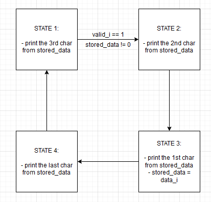

# VHDL-Decryption

A small decryption module, written in Verilog, as a university assignment.

It can decrypt the following cyphers:
  - caesar cypher
  - scytale cypher
  - zigzag cypher/rail-fence cypher (for `key=2` or `key=3`)

## Modules Overview
### Decryption Regfile

This block acts like both a memory and a memory controller.

It plays the role of memory, like RAM to a PC, as in, it stores a few values, more specifically the keys needed to decrypt the incoming messages, in registers and they can later on be retrieved, and the role of the controller as it handles both reading and writing to multiple registers.

Two signals, more specifically `read` and `write` describe the nature of the action that is about to be performed and, based on that, either `wdata` is dumped into the appropriate register, or `rdata` is extracted from it. The register is specified via `addr`.
There are 4 registers which store data:

- `select_register` -> holds the `select` signal for the MUX and DEMUX blocks
- `caesar_key_register`, `scytale_key_register`, `zigzag_key_register` -> hold the keys needed to decypher the respectively encrypted messages

There are 2 more signals of interest:

- `done`, which basically acts like an enable signal for all outs
- `error` which indicates an unavailable address in `addr`

#### Inputs

``` verilog
input clk       // system clock
input rst_n     // reset signal

// Register access interface
input [addr_witdth - 1 : 0]  addr  // the address of the desired register
input                        read  // basically a read_enable signal
input                        write // basically a write_enable signal
input [reg_width - 1 : 0]    wdata // the written data
```

#### Outputs

``` verilog
output reg [reg_width - 1 : 0]  rdata   // the read data
output reg                      done    // 'bool' value to indicate status
output reg                      error   // 'bool' value to indicate errors

// Output wires
output reg [reg_width - 1 : 0] select       // The signal that will be 
                                            // sent to the MUX & DEMUX blocks
output reg [reg_width - 1 : 0] caesar_key   // The key needed to decrypt the
                                            // caesar message
output reg [reg_width - 1 : 0] scytale_key  // The key needed to decrypt the
                                            // scytale message
output reg [reg_width - 1 : 0] zigzag_key   // The key needed to decrypt the
                                            // zigzag message
```

### Caesar Decryption

This algorithm basically shifts all characters to the right, and that's it.

In order to decrypt it, we just subtract `key` from each character received:

``` verilog
// if !reset is high -> reset is low
if (rst_n) begin
    // set [valid_o] to high if [valid_i] was high last clock
    valid_o <= valid_i;

    // if [valid_i] was high last clock, decrypt input message and
    // send it to [data_o]
    data_o <= (valid_i) ? data_i - key : 0;
end 
```

### Scytale Decryption

This algorithm involves writing the given string into a `M`x`N` matrix, row by row and then reading line by line.

By performing a simple example, pen-on-paper style, for a word of length `16`, with the matrix size of 4x4, we get the following:

``` fenced-code-language
1 2 3 4 5 6 7 8 9 10 11 12 13 14 15 16 ->

1  5  9 13
2  6 10 14
3  7 11 15
4  8 12 16

-> 1 5 9 13 2 6 10 14 3 7 11 15 4 8 12 16
```

So what we can observe the rule:

1. Starting from character 1, we increment by the number of columns
2. Once the increment overflows the number of total characters, we move to start from the second element
3. We keep doing this for x iterations, where x is the number of rows

We can model this behaviour with a nested for loop:

``` C
for (int i = 0; i < key_N; i++) {
    for (int j = i; j < n; j += key_N) {
        print( message[j] );
    }
}
```

However, in verilog, we want to model this loop in such a way that each iteration is executed in a clock cycle:

``` verilog
always @(posedge clk)
    if (busy) begin 
        // This prints the i'th line of the matrix
        if (j < n) begin // we can observe the stop condition for the 2nd loop
            valid_o <= 1;
            data_o <= message[D_WIDTH * j +: D_WIDTH ];
            j <= j + key_N; // the increment condition for the second loop
        end else begin
            valid_o <= 1;
            i <= i + 1; // the increment condition for the first loop
            j <= i + 1 + key_N;
            
            if (i + 1 < key_N) begin // the stop condition for the first loop
                data_o <= message[D_WIDTH * (i+1) +: D_WIDTH ];
            end
        end
    end
end
// see the code for a more in depth explanation
```

### ZigZag Decryption

This algorithm involves writing the decrypted message in a zigzag fashion inside a matrix with a given number of rows, and then reading the message line by line to get the encryption.

We're going to treat two distinct cases, one for `key==2` and one for `key==3`.

#### Key == 2

By performing a basic decryption with a pen on paper, for `n=8`, we get the following:

``` zigzag-code
1 2 3 4 5 6 7 8 ->

1   2   3   4
  5   6   7   8

-> 1 5 2 6 3 7 4 8
```

We can observe the rule as:

``` zigzag-code
1 (1+4) 2 (2+4) 3 (3+4) 4 (4+4)
```

We can model this behaviour with a for loop:

``` C
for (int i = 0; i < n /2; i++) {
    print(i);
    print(i + n/2);
}
```

In order to get this `for` to execute on a per-clock fashion, we have to model our verilog code like so:

``` verilog
always @posedge(clk) begin
    valid_o <= 1;
    index_o <= index_o + 1;
    case (state)
        0: begin
            // The input string is basically split in 2
            // This state prints the element on position i
            // (the i-th element? english is hard)
            // from the first sub-string
            data_o <= message[D_WIDTH * i +: D_WIDTH]; // print(i)
            state <= 1; // go print from the second substring
        end
        1: begin
            // The input string is basically split in 2
            // This state prints the element on position i
            // from the second sub-string
            data_o <= message[D_WIDTH * ( i + aux1 ) +: D_WIDTH]; // print(i+k)
            i <= i + 1; // i++
            state <= 0; // go back and print from the first substring
        end
    endcase
end
// see the code for a more in depth explanation
```

#### Key = 3

By performing a basic decryption with a pen on paper, for `n=18`, we get the following:

``` zigzag-code
1 2 3 4 5 6 7 8 9 10 11 12 13 14 15 16 ->

1      2      3        4        5
  6  7   8  9   10  11   12  13   18
   14     15      16       17

-> 1 5 13 6 2 7 14 8 3 9 15 10 4 11 16 12
```

In order to solve this one, we have to split our initial string into 3 sub-strings. We have to figure out the length of each sub-string. Each one will represent one row in our matrix.

First of all, let's set up a common ground. This is what we'll refer to as a _full cycle_:

``` zigzag-code
1
  6  7
   14
```

And this is a _partial cycle_:

``` zigzag-code
5
  18
```

The first row has one element per full cycle, and one more if there is a partial cycle. Mathematically, we can model it like se: `n/4 + (n % 4 > 0)`, where `(n % 4 > 0)` is a boolean expression that evaluates to `1` if `true` or `0` if `false`.

The second row has 2 elements per full cycle, and one more if the partial cycle has at least 2 elements. Again, mathematically, that adds up to: `2*n/4 + (n % 4 > 1)`.

The third row is similar to the first, but the partial cycle has to have 3 elements. We don't need this variable in our code, but here is the mathematical expression: `n/4 + (n % 4 > 2)`

Now, what we need to do is to get 3 indexes, `i`, `j` and `k`, each one corresponding to the respective substring. Initially, `i=0`, `j=n/4 + (n % 4 > 0)` and `k = n/4 + (n % 4 > 0) + 2*n/4 + (n % 4 > 1)`. From now on, we basically have to do the following sequence until we run out of characters in our message:

``` C
print(message[i++]); // state 0
print(message[j++]); // state 1
print(message[k++]); // state 2
print(message[j++]); // state 3
```

Modelling this into a wannabe FSM that executes on the positive edge of the clock cycle, we get:

``` verilog
always @(posedge clk) begin
    valid_o <= 1; // output enable

    // Iteration counter. Should never exceed [n].
    index_o <= index_o + 1;

    // FSM implementation. 
    // According to the states mentioned above, we go 1-2-3-2
    // and repeat
    case (state)
        0: begin // print(message[i++]);
            data_o <= message[D_WIDTH * i +: D_WIDTH];
            i <= i + 1;
            state <= 1;
        end
        1: begin // print(message[j++]);
            data_o <= message[D_WIDTH * ( j + aux1 ) +: D_WIDTH];
            j <= j + 1;
            state <= 2;
        end
        2: begin // print(message[k++]);
            data_o <= message[D_WIDTH * ( k + aux1 + aux2 ) +: D_WIDTH];
            k <= k + 1;
            state <= 3;
        end
        3: begin// print(message[j++]); again
            data_o <= message[D_WIDTH * ( j + aux1 ) +: D_WIDTH];
            j <= j + 1;
            state <= 0;
        end
    endcase
end
```

### Demux

This block handles routing the input message from the master device to the appropriate decryption block.

The `select` signal comes from the register bank.

Due to the fact that the master device works on a 4 times slower clock, the input data to the demux is 32 bits wide, and it splits it into 4 8-bit packets. Those packets all get routed in the immedate following 4 clock cycles (system clock, not master clock), even if another message is received.

To implement this functionality, a FSM was modelled.



What basically happens is that state 1 is held continuously until `valid_i` goes to `HIGH`. From that point, the next 2 clock cycles are basically idle, printing a null character (since `stored_data` is 0). State 3 ensures that state 4 has `data_i` inside `stored_data` and basically state 4 begins the printing cycle, going from char 4 to char 1. The cycle ends when `valid_i` is `LOW` and `stored_data` is 0.

### Mux

This block is basically the reverse of the demux block. While the demux block made sure that each decryption block had the appropriate inputs, this mux block ensures that the correct output si routed to the "system" `data_o`. Each decryption block output is an input to the mux, along side the `valid_o`. The select comes, again, from the register bank, just like it did for the demux.
The `data_o` and `valid_o` signals are then routed accordingly.

This basic 'switching' logic is easily implemented with a `case` and some ternary operators:

``` Verilog
case (select)
    2'b00: begin
        data_o <= (valid0_i) ? data0_i : 0;
        valid_o <= (valid0_i);
    end
    
    2'b01: begin
        data_o <= (valid1_i) ? data1_i : 0;
        valid_o <= (valid1_i);
    end
    
    2'b10: begin
        data_o <= (valid2_i) ? data2_i : 0;
        valid_o <= (valid2_i);
    end
endcase
```

### Top

This bit of code simply instantiates all the modules defined above, and assigns the system `busy` port to be `HIGH` if either one of the `busy` ports from caesar, scytale or zigzag. No point in copy-pasting code here. Have a [hyperlink](./decryption_top.v).

## What I learned
1. Some of the quirks of VHDL programming
2. How to manage combinational and sequencial logic blocks
3. How to model for loops inside a clocked sequencial block via mimicking FSMs
4. What the scytale and zigzag cyphers are, :))
5. How to link up multiple modules to create a more complex project

## Feedback, suggestions and help

For feedback, suggestions, bug reports etc., feel free to e-mail me at 'mike.anth99@gmail.com'.

---

_a project by Mircea-Pavel Anton (Mike Anthony)_
